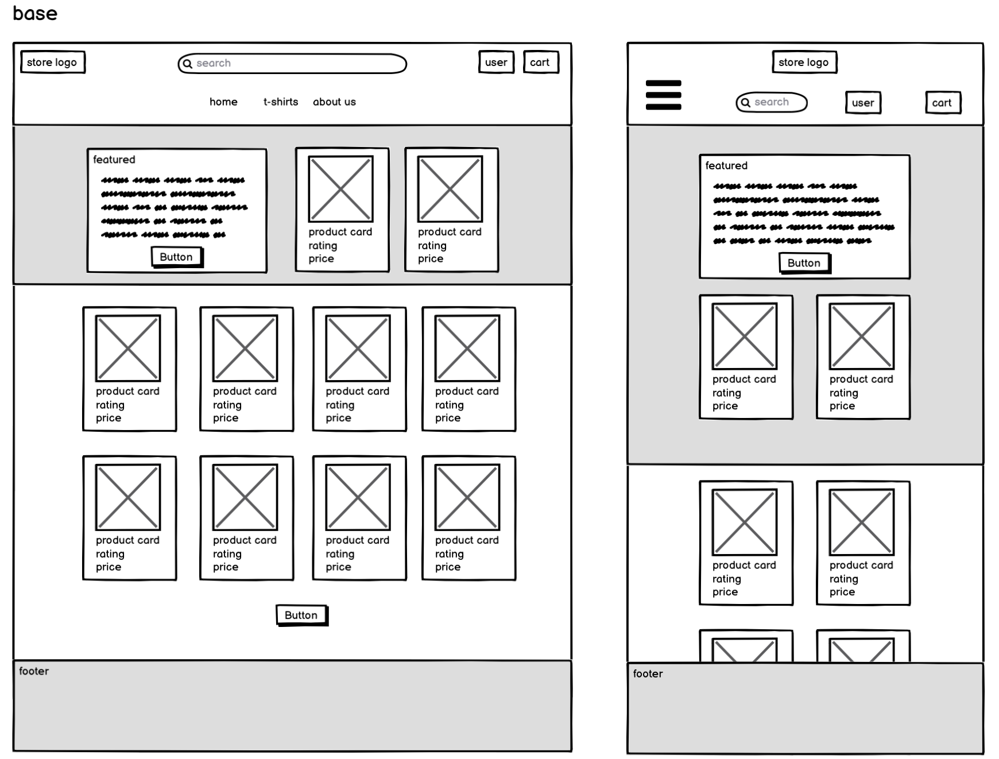
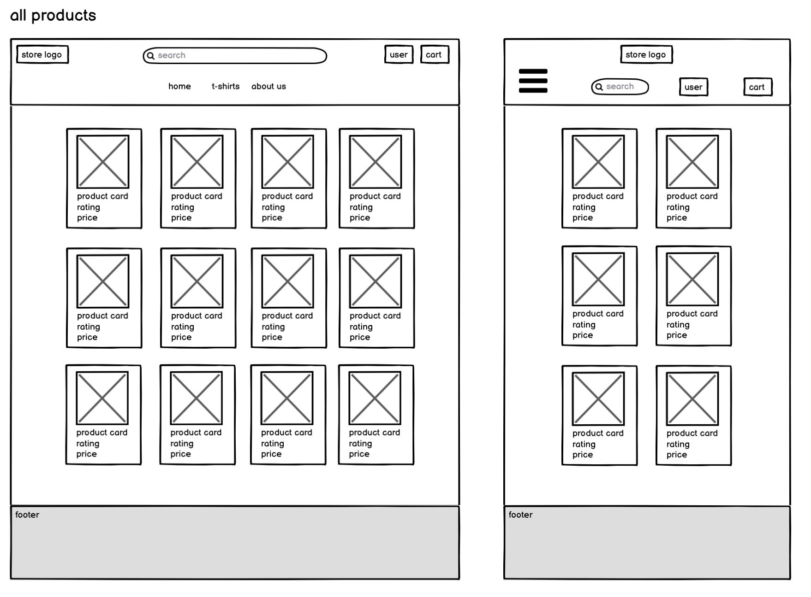
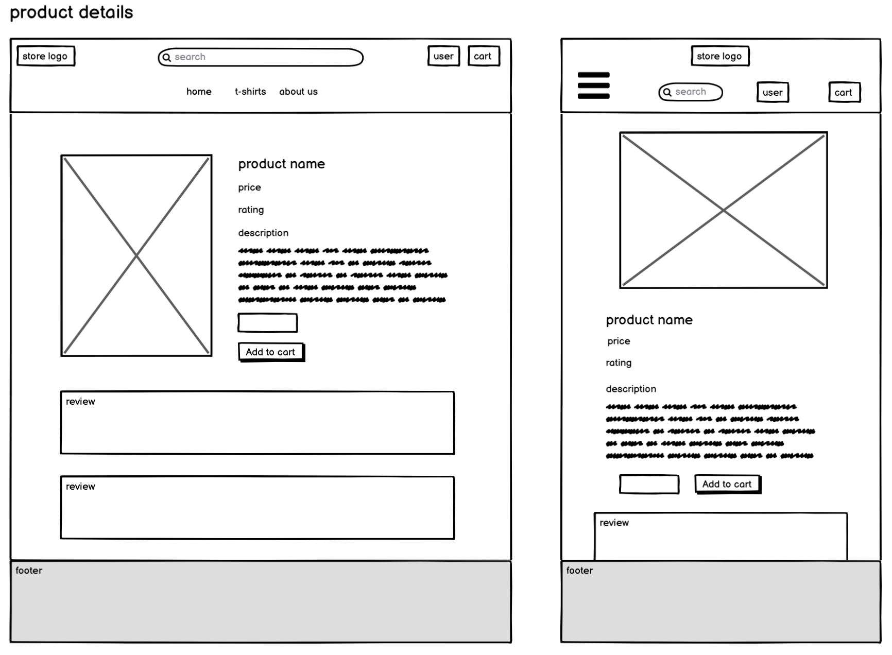
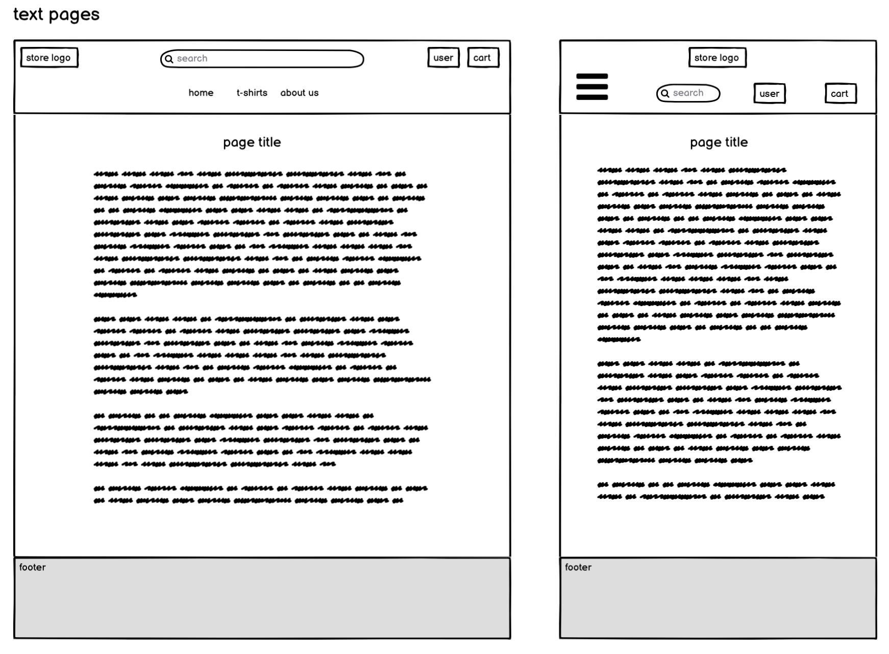
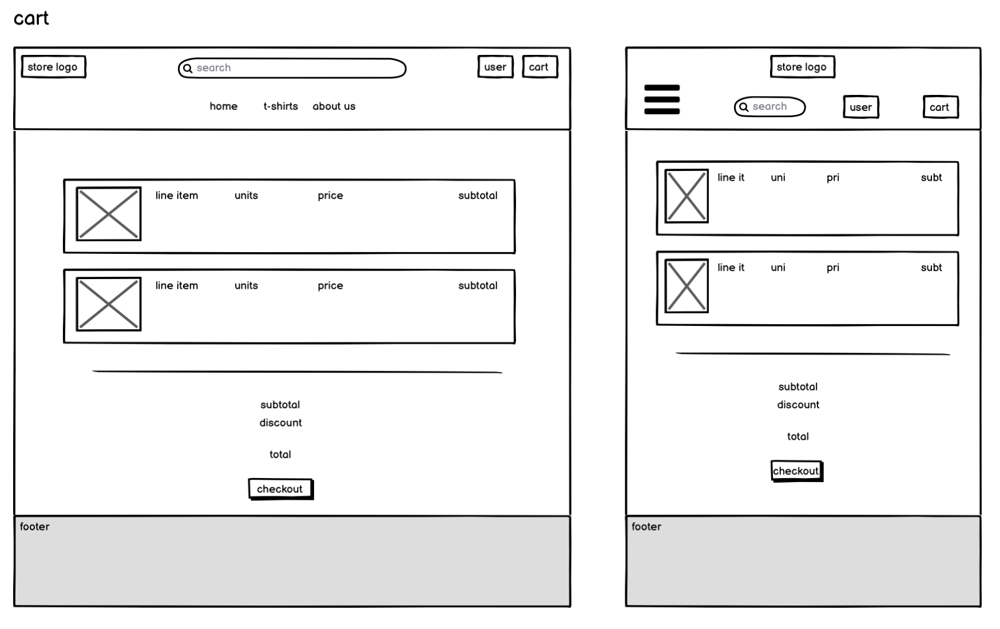
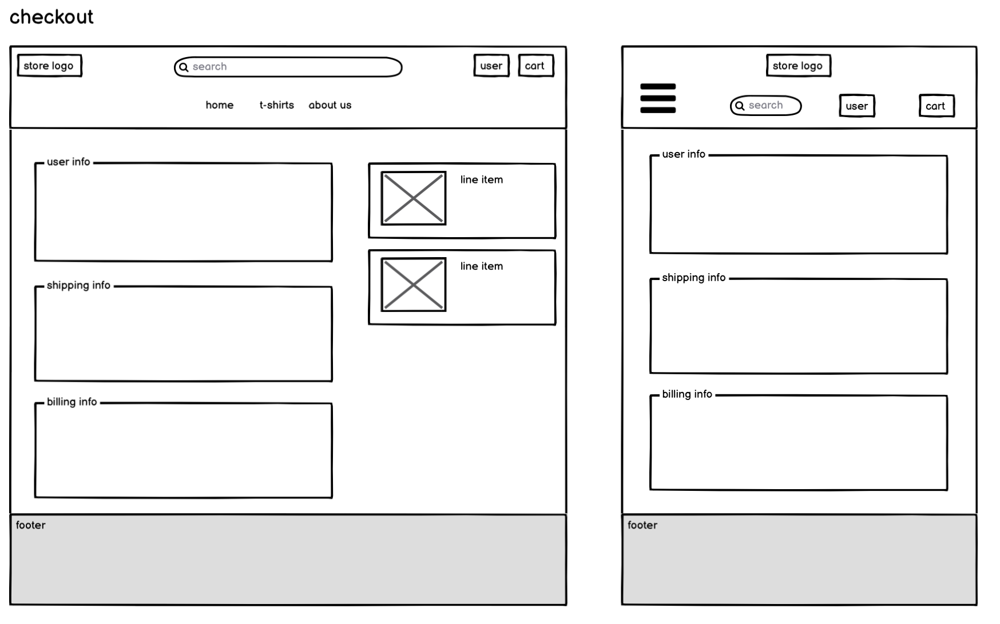
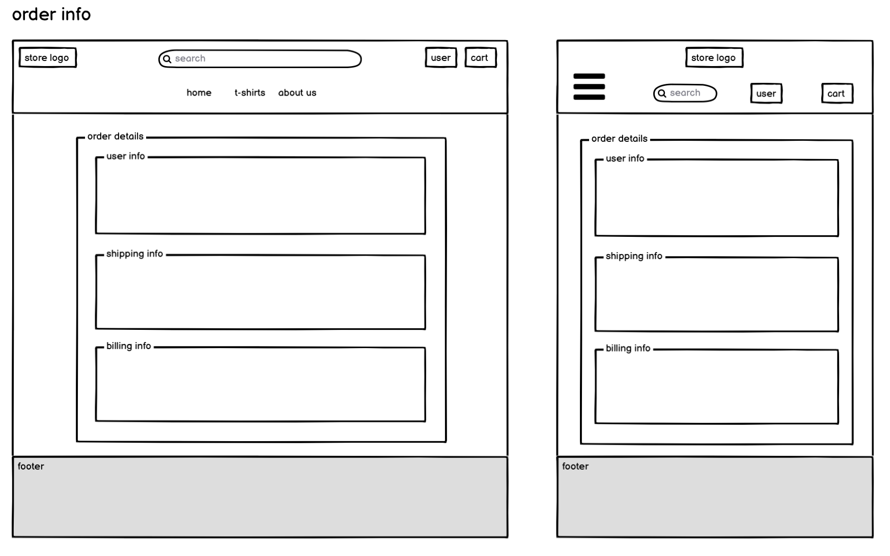
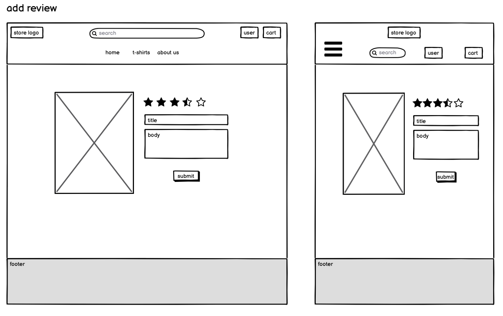
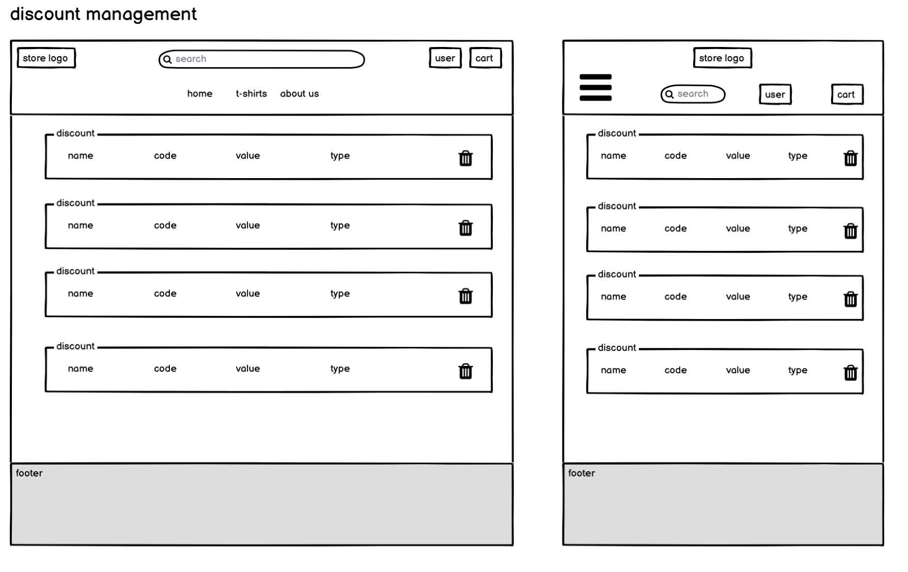
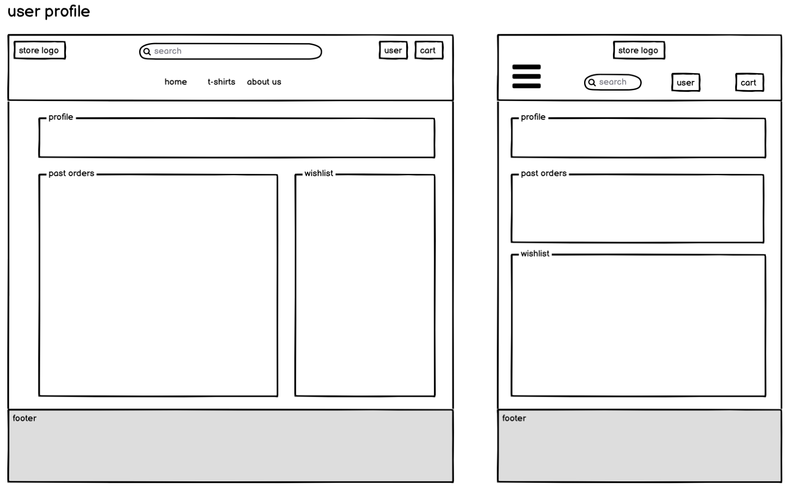

# Vespre
Check out the deployed website [here](http://vespre.herokuapp.com/)

AMIRESPONSIVE IMAGE - TODO

&#9989;
&#10060;

&#10003;
&#65794;

# Table of Contents
> - [Introduction](#introduction) &#10003;
> - [UX](#ux) &#10003;
> - [Epics](#epics) &#10003;
> - [User Stories](#user-stories) &#10003;
> - [Design](#design) &#10003;
> - [Wireframes](#wireframes) &#10003;
> - [Database Design](#database-design) &#10003;
> - [Features](#features)
> - [Tech stack](#tech-stack) &#10003;
> - [SEO](#seo) &#10003;
> - [Social Media](#social-media) &#10003;
> - [Validation](#validation)
> - [Testing](#testing)
> - [Future plans](#future-plans)
> - [Deployment](#deployment) &#10003;
> - [Installation](#installation) &#10003;
> - [Credits](#credits)
> - [Acknowledgements](#acknowledgements)

# Introduction
Created in 2019, Vespre is a tee-shirt store with designs reminiscent of sunsets. The word Vespre - Sunset in Catalan - serves as vehicle and inspiration for the designer and owner to create designs based on his main intetests. Ranging from world landmarks, inspiring settings and pop culture references, we're sure you will find something for you!

# UX
## Objectives / goals
- This store serves its admins/owners as a platform where to sell their t-shirts and designs, busines to consumer (B2C).
- This store allows admins/owners to maintain various aspects of their business online, product creation, modification, deletion, creation and deletion of discounts and other admin tasks.
- Users are presented the whole colection of products from which to make a purchase.


> Vespre is an online store operating through print on demand. Customers can purchase their favourite designs and will receive their order as soon as it is printed and delivered by the partner. This reduces expenses for the business owner while on the growth state, not needing to care about logistics and warehousing.


# Epics
This project's User Stories are distributed among 5 main Epics:
- Accounts
- Navigation
- Advanced navigation
- Cart and checkout
- Admin

# User Stories

>| Code | As a | I want to be able to | so that I can |
>| --- | --- | --- | --- |
>|  Accounts  |    |   | |
>|  A1  |  User  |  register for a new account  | have a user profile with my details |
>|  A2  |  User  |  log in / out  | view my personal information |
>|  A3  |  User  |  recover my password  | regain access to my account |
>|  A4  |  User  |  save address information in my profile  | have faster checkouts with pre-filled information |
>|  A5  |  User  |  access my profile  | view past orders and edit my default shipment information |
>|  A6  |  User  |  review products  | let others know what I think of my purchases |
>|  A7  |  User  |  keep a wishlist  | quickly review my favorites for future purchases |
>|  Navigation  |   |   | |
>|  N1  |  Customer  |  view all products  | decide which to purchase |
>|  N2  |  Customer  |  view product details  | make an informed decision of what items to purchase |
>|  N3  |  Customer  |  view product ratings  | have an understanding of other buyer's sentiment |
>|  N4  |  Customer  |  clearly identify offers  | save on my purchases |
>|  N5  |  Customer  |  always see my cart total  | have a good idea of how much I'm spending >even while browsing |
>|  Advanced Navigation  |   |   | |
>|  AN1  |  Customer  |  sort the products page  | quickly identify the newest, most sold and best priced products |
>|  AN2  |  Customer  |  filter by category  | only see products that I'm interested in seeing |
>|  AN3  |  Customer  |  search products by name or description  | quickly find exactly what I'm looking for |
>|  Cart and Checkout  |   |   | |
>|  C1  |  Customer  |  add products to cart with appropriate quantity and size  | purchase items |
>|  C2  |  Customer  |  view the cart  | have an overview of what items I will purchase |
>|  C3  |  Customer  |  edit the cart  | add or remove products before committing to the purchase |
>|  C4  |  Customer  |  intuitively enter all my info at checkout  | be sure that I'm making the correct purchase with the correct details |
>|  C5  |  Customer  |  understand the payment process and who is the provider  | feel secure >about the purchase |
>|  C6  |  Customer  |  view a confirmation screen and email for the purchase  | be sure that the order was successful |
>|  C7  |  Customer  |  use discounts  | save some money on my purchases |
>|  Admin  |   |   | |
>|  SA1  |  Store admin  |  Create new products  | offer them to my customers online |
>|  SA2  |  Store admin  |  Edit existing products  | correct mistakes, toggle publication status, create offers, etc. |
>|  SA3  |  Store admin  |  Delete existing products  | keep my store with the most updated products |
>|  SA4  |  Store admin  |  Create new discounts  | offer cart-wide discounts to my customers |

# Design

- Google font *Assistant* has been chosen as the font for this project as it helps transmit the same idea of calm and peace that the designs do
- In terms of color I have opted for a basic configuration of white for most pages.
- When background colors are present to highlight certain sections a subtle color gradient reminiscent of a sunset has been used, sparringly so as to not to over-saturate users.
- Links and buttons use a shade of teal that helps deliver the main message of the store.

# Wireframes

See low-fi wireframes for the following pages:

> Base



>All products



>Product details



>Text pages



>Cart



>Checkout



>Order confirmation



>Add review



> Discount management



>User profile




---

# Database Design
Quick overview of the design of all the database model for the different apps created for this store. Please note this is may not 1:1 to the actual models in the django app as project needs have evolved during development.

## Product
>|  Field name  |  Field type  |
>| --- | --- |
>|  sku  |  models.CharField(max_length=254, null=True, blank=True)  |
>|  name  |  models.CharField(max_length=254)  |
>|  description  |  models.TextField()  |
>|  price  |  models.DecimalField(max_digits=6, decimal_places=2)  |
>|  compare_at_price  |  models.DecimalField(max_digits=6, decimal_places=2)  |
>|  has_sizes  |  models.BooleanField(default=False, null=True, blank=True)  |
>|  image  |  models.ImageField(null=True, blank=True)  |
>|  imageURL  |  models.URLField(max_length=1024, null=True, blank=True)  |
>|  reviews  |  models.ForeignKey(Reviews, on_delete=models.SET_NULL, null=True, blank=True, related_name='reviews')  |
>|  rating *1  |  models.DecimalField(max_digits=6, decimal_places=2, null=True, blank=True)  |


## Customer
> |  Field name  |  Field type  |
>| --- | --- |
>|  user  |  models.OneToOneField(User, on_delete=models.CASCADE)  |
>|  phone  |  models.CharField(max_length=20, null=True, blank=True)  |
>|  email  |  models.CharField(max_length=80, null=True, blank=True)  |
>|  address_1  |  models.CharField(max_length=80, null=True, blank=True)  |
>|  address_2  |  models.CharField(max_length=80, null=True, blank=True)  |
>|  town_or_city  |  models.CharField(max_length=40, null=True, blank=True)  |
>|  county  |  models.CharField(max_length=80, null=True, blank=True)  |
>|  postcode  |  models.CharField(max_length=20, null=True, blank=True)  |
>|  country  |  CountryField(blank_label='Country', null=True, blank=True)  | 

## Order
>|  Field name  |  Field type  |
>| --- | --- |
>| order_number | models.CharField(max_length=32, null=False, editable=False) |
>| user_profile | models.ForeignKey(UserProfile, on_delete=models.SET_NULL, null=True, blank=True, related_name='orders') |
>| full_name | models.CharField(max_length=50, null=False, blank=False) |
>| email | models.EmailField(max_length=254, null=False, blank=False) |
>| phone_number | models.CharField(max_length=20, null=False, blank=False) |
>| country | CountryField(blank_label='Country *', null=False, blank=False) |
>| postcode | models.CharField(max_length=20, null=True, blank=True) |
>| town_or_city | models.CharField(max_length=40, null=False, blank=False) |
>| street_address1 | models.CharField(max_length=80, null=False, blank=False) |
>| street_address2 | models.CharField(max_length=80, null=True, blank=True) |
>| county | models.CharField(max_length=80, null=True, blank=True) |
>| date | models.DateTimeField(auto_now_add=True) |
>| delivery_cost | models.DecimalField(max_digits=6, decimal_places=2, null=False, default=0) |
>| order_total | models.DecimalField(max_digits=10, decimal_places=2, null=False, default=0) |
>| grand_total | models.DecimalField(max_digits=10, decimal_places=2, null=False, default=0) |
>| original_bag | models.TextField(null=False, blank=False, default='') |
>| stripe_pid | models.CharField(max_length=254, null=False, blank=False, default='') |


## Order Line Item
>|  Field name  |  Field type  |
>| --- | --- |
>|  order  |  models.ForeignKey(Order, null=False, blank=False, on_delete=models.CASCADE, related_name='lineitems')  |
>|  product  |  models.ForeignKey(Product, null=False, blank=False, on_delete=models.CASCADE) |
>|  product_size |  models.CharField(max_length=2, null=True, blank=True) |
>|  quantity  |  models.IntegerField(null=False, blank=False, default=0)  |
>|  lineitem_total  |  models.DecimalField(max_digits=6, decimal_places=2, null=False, blank=False, editable=False)  |

---

## Review (new model)

>|  Field name  |  Field type  |
>| --- | --- |
>|  rating  |  models.IntegerField(max_digits=1, null=False, blank=False, default=0)  | # 1, 2, 3, 4, 5
>|  product  |  models.ForeignKey(Product, on_delete=models.CASCADE, related_name="reviews")
>|  note  |  models.CharField(null=False, blank=False)  |
>|  customer  |  models.ForeignKey(Customer, null=False, blank=False, on_delete=models.CASCADE  |

## Discount(new model)
>|  Field name  |  Field type  |
>| --- | --- |
>|  code *1  |  models.CharField(max_length=32, null=False, editable=False)  |
>|  min_order_value  |  models.IntegerField(max_digits=6, null=False, blank=False, editable=False, default=0)  |
>|  amount  |  models.IntegerField(max_digits=6, null=False, blank=False, editable=False, default=10)  |

## Wishlist(new model)
>|  Field name  |  Field type  |
>| --- | --- |
>|  user_profile  |  models.ForeignKey(UserProfile, on_delete=models.CASCADE,related_name="wishlist")  |
>|  products  |  models.ManyToManyField(Product, related_name='products')  |


# Features

Below is a list of features users and admins can perform in the website


# Tech stack

## Languages

- [HTML5](https://en.wikipedia.org/wiki/HTML5)
- [CSS3](https://en.wikipedia.org/wiki/Cascading_Style_Sheets)
- [JavaScript](https://www.javascript.com/)
- [Python](https://www.python.org/)

## Frameworks 

- [Django](https://www.djangoproject.com/) - Python Framework / backend used to quickly create web apps
- [Bootstrap](https://getbootstrap.com/docs/4.6/getting-started/introduction/) - CSS framework to provide base styles and row/column layouts
- [PostgreSQL](https://www.postgresql.org/) - External Database
- [FontAwesome](https://fontawesome.com/) - Icons used throughout the website
- [Google Fonts](https://fonts.google.com/) - Font Assistant used throughout the project
- [jQuery](https://jquery.com/) - JavaScript Library to speed up some aspects of the front-end coding
- [Stripe](https://stripe.com/ie) - Payment gateway integrated (test mode)
- [AWS](https://www.aws.com/) - Amazon Web Services (S3) has been used to hold static files like CSS and media files like images
- [Crispy Forms](https://django-crispy-forms.readthedocs.io/en/latest/) - A Django extension that allows for consistent and fast styling for forms throughout the application
- [Allauth](https://django-allauth.readthedocs.io/en/latest/installation.html) - A Django extension used to handle all authorisation needs consistently

## Workspace

- [Gitpod](https://www.gitpod.io/) - IDE, browser version of VSCode that integrates nicely with Github
- [Git](https://git-scm.com/) - Version Control
- [GitHub](https://github.com/) - Repo storage
- [Heroku](https://www.heroku.com/free) - Website deployment


# SEO

## Selected SEO Keywords

- Meta description and keywords added to the HTML to boost SEO.
- Media files named after SEO best practices.
- Semantic HTML used throughout the project to help improve store quality.
- Site title tag carefully selected to boost specific keywords.
- A `sitemap.xml` file has been created and added to the root directory using [xml-sitemaps](https://www.xml-sitemaps.com/details-vespre.herokuapp.com-ee88ee479.html).
- Created `robots.txt` and disallow some folders from being crawled.

# Social Media

Both accounts exist as part of Vespre's social media strategy previous to this project. A new social strategy is being implemented after learning about keyword searching. Facebook will be used mainly as a point of contact and selling platform. Instagram will be used as a promo and engagement tool. At this stage there are no plans for using TikTok. 

## Facebook account
- Vespre store's [Facebook account](https://www.facebook.com/vespredesign/)

## Instagram account
- Vespre store's [Instagram account](https://www.instagram.com/vespre_design/)

# Validation

All rendered html pages have been validated through [W3C Markup Validation Service](https://validator.w3.org/)

|  HTML  |  Comments  |  Status  |
| --- | --- | --- |
| Global | Ignored Duplicate Id messages as once show on mobile and the others on medium and up as per CI initual design for Boutique Ado |  |
|  | Ignore js does not require type attribute I like having it there for consistency |  |
| Home |   |  &#10003; |
| All products |  | &#10003; |
| About us |  | &#10003; |
| Discounts |  | &#10003; |
| Create discount |  | &#10003; |
| Create product |  | &#10003; |
| User profile |  | &#10003; |
| About us |  | &#10003; |
| About us |  | &#10003; |
|  |  |  |
|  |  |  |

# Testing
# Future plans

# Deployment

Pre-requisites:
- The project's repository can be found at [gh - khalanar/vespre](https://github.com/Khalanar/vespre)
- Register for a [Stripe](https://www.stripe.com) account and get your keys.
- Register for a free AWS account and add a new S3 bucket for this project.

## Deploy and run through Heroku
- Log into [Heroku](https://www.heroku.com/) and create a new app by clicking on the 'New' button and selecting 'Create new app'.
- Type the name for your app and select a region that's closer to your actual location.
- Go to the **Resources** tab and create a new free PostgreSQL database
- Add the following *Config Vars* into Heroku's **Settings** tab

```
DISABLE_COLLECTSTATIC=1
SECRET_KEY=<your_project_key>
STRIPE_PUBLIC_KEY=<your_personal_public_key>
STRIPE_SECRET_KEY=<your_personal_secret_key>
STRIPE_WH_SECRET=<your_personal_webhook_key>
EMAIL_HOST_PASS=<your_email_password>
EMAIL_HOST=<your_email_address>
USE_AWS= True
AWS_ACCESS_KEY_ID=<your_aws_user_access_id>
AWS_SECRET_ACCESS_KEY=<your_aws_user_access_password>
DATABASE_URL=<your_heroku_postgres_uri>
```
- Add the Heroku project url to the list of `ALLOWED_HOSTS` in the project's `settings.py`.
- Back in Heroky, go to the *Deploy* tab.
- Select *Github* under *Deployment method* and enter your GH username.
- Search for the relevant repo.
- Select Automatic deploys from the main branch or click 'Deploy Branch'.
- Heroku will then clone and host the selected Github repo.
- Once this is done click **Open app**.

# Installation
## Run locally with Gitpod

To clone this project into your IDE you will need:

- A **GitHub** account. Create one [here](https://github.com/join).
- **Google Chrome** browser.

Follow this steps:

1. Install the [Gitpod Browser Extentions for Chrome](https://chrome.google.com/webstore/detail/gitpod-dev-environments-i/dodmmooeoklaejobgleioelladacbeki).
2. Restart the browser once completed.
3. Log into [Gitpod](https://www.gitpod.io/) with your Github account.
4. Navigate to the [Project GitHub repository](https://github.com/Khalanar/vespre).
5. Click the green *Gitpod* button in the top right corner of the repo.
6. On the terminal, install Django:
```
pip3 install django
```
7. Install project dependencies by running the command:
```
pip3 install -r requirements.txt
```
8. Add the below environment variables to run the project. Note, you can create these under a new `env.py` file at the project level. Git has been set up to ignore this file to avoid potential secrets being exposed into Github:
   ```
   DEVELOPMENT=True
   STRIPE_PUBLIC_KEY=<your_personal_public_key>
   STRIPE_SECRET_KEY=<your_personal_secret_key>
   STRIPE_WH_SECRET=<your_personal_webhook_key>
   ```
9. Create project models and database by running the following commands:
```
python3 manage.py makemigrations
python3 manage.py migrate
```
10. Run server locally with the following command:
```
python3 manage.py runserver
```

## Run locally with IDE of choice

1. Open the project's [repository](https://github.com/khalanar/vespre).
2. Click *Code* and copy the url shown under *HTTPS*
3. In the directory where you want to download this project, open the terminal and type *git clone* followed by the copied url from step 2, then paste the URL of the project.
4. On the terminal, install Django with the follow command:
```
pip3 install django
```
5. Install project dependencies by running the command:
```
pip3 install -r requirements.txt
```
6. Add the below environment variables to run the project. Note, you can create these under a new `env.py` file at the project level. Git has been set up to ignore this file to avoid potential secrets being exposed into Github:
   ```
   DEVELOPMENT=True
   STRIPE_PUBLIC_KEY=<your_personal_public_key>
   STRIPE_SECRET_KEY=<your_personal_secret_key>
   STRIPE_WH_SECRET=<your_personal_webhook_key>
   ```
7. Create project models and database by running the following commands:
```
python3 manage.py makemigrations
python3 manage.py migrate
```
8. Run server locally with the following command:
```
python3 manage.py runserver
```

# Credits
# Acknowledgements
